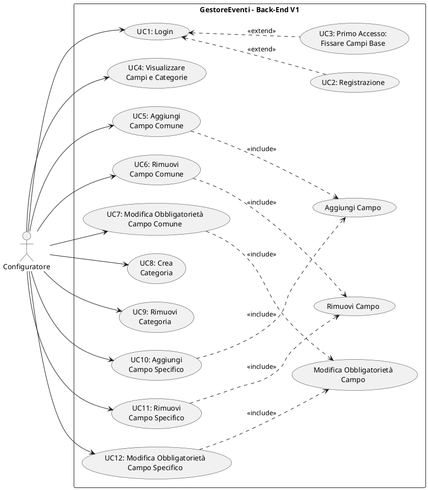

# Documentazione dei Casi d'Uso – Versione 1

---

## 1. Attori

| Attore | Descrizione |
|---|---|
| **Configuratore** | Utente autorizzato che opera sul back-end dell'applicazione. Definisce la struttura organizzativa delle iniziative: campi base, campi comuni, categorie e relativi campi specifici. Accede tramite credenziali predefinite al primo accesso, poi tramite credenziali personali. |

---

## 2. Casi d'Uso

---

### UC1 – Login

| | |
|---|---|
| **Nome** | Login |
| **Attore** | Configuratore |
| **Scenario principale** | 1. Il configuratore inserisce username e password.   2. Il sistema verifica le credenziali con l'archivio utenti.   3. Il sistema concede l'accesso al Menu Principale.   Postcondizione: il configuratore è autenticato e ha accesso al Menu Principale.   Fine |
| **Scenario alternativo** | 2a. Le credenziali inserite sono le credenziali predefinite ("config"/"config").   Il sistema riconosce il primo accesso e attiva «extend» **Registrazione** (UC2).   Fine |
| **Scenario alternativo** | 2b. Le credenziali sono errate o l'account non esiste.   Il sistema segnala che le credenziali non sono valide.   Torna al punto 1. |
| **Scenario alternativo** | 3a. Precondizione: i campi base non sono ancora stati fissati (primo avvio del sistema).   Il sistema blocca l'accesso al Menu Principale e attiva «extend» **Primo Accesso** (UC3).   Al completamento di UC3, il sistema sblocca l'accesso al Menu Principale.   Fine |

---

### UC2 – Registrazione

| | |
|---|---|
| **Nome** | Registrazione |
| **Attore** | Configuratore |
| **Scenario principale** | 1. Il sistema notifica la necessità di scegliere credenziali personali e mostra i vincoli (username ≥ 3 caratteri, password ≥ 4 caratteri).   2. Il configuratore inserisce un nuovo username.   3. Il sistema valida lo username (univocità, lunghezza minima, non riservato).   4. Il configuratore inserisce una nuova password.   5. Il sistema valida la password (lunghezza minima).   6. Il sistema registra il nuovo account e lo salva persistentemente.   Postcondizione: il configuratore possiede credenziali personali ed è autenticato.   Fine |
| **Scenario alternativo** | 3a. Lo username non è valido (troppo corto, duplicato o riservato).   Il sistema mostra un messaggio d'errore specifico.   Torna al punto 2. |
| **Scenario alternativo** | 5a. La password è troppo corta (meno di 4 caratteri).   Il sistema mostra un messaggio d'errore.   Torna al punto 4. |
| **Scenario alternativo** | 2a. Il configuratore digita "annulla".   Il sistema annulla la registrazione.   Torna al Login (UC1). |

---

### UC3 – Primo Accesso: Fissare i Campi Base

| | |
|---|---|
| **Nome** | Primo Accesso – Fissare i Campi Base |
| **Attore** | Configuratore |
| **Scenario principale** | 1. Il sistema mostra gli 8 campi base predefiniti (Titolo, Numero di partecipanti, Termine ultimo di iscrizione, Luogo, Data, Ora, Quota individuale, Data conclusiva).   2. Il sistema chiede se si desidera aggiungere campi base supplementari.   3. Il configuratore sceglie di non aggiungerne.   4. Il sistema fissa i campi base, li rende immutabili e li salva persistentemente.   Postcondizione: i campi base sono fissati e immutabili per l'intera vita dell'applicazione. L'accesso al Menu Principale è sbloccato.   Fine |
| **Scenario alternativo** | 3a. Il configuratore sceglie di aggiungere campi supplementari.   Il configuratore inserisce i nomi dei campi aggiuntivi (tutti obbligatori, tipo Stringa).   Il sistema verifica l'univocità di ciascun nome.   Torna al punto 4. |
| **Scenario alternativo** | 3b. Un nome inserito è duplicato.   Il sistema segnala l'errore e impedisce il completamento.   Torna al punto 2. |
| **Scenario alternativo** | 3c. Il configuratore annulla l'operazione.   I campi base non vengono fissati. Il sistema ripresenta l'operazione.   Torna al punto 1. |

---

### UC4 – Visualizzare Campi e Categorie

| | |
|---|---|
| **Nome** | Visualizzare Campi e Categorie |
| **Attore** | Configuratore |
| **Scenario principale** | 1. Il configuratore seleziona una voce dal Menu Principale.   2. Il sistema mostra le informazioni corrispondenti:   — "Gestire campi BASE": elenco dei campi base con stato "FISSATI (immutabili)" e relativi tipi di dato.   — "Gestire campi COMUNI": elenco dei campi comuni attualmente definiti.   — "Gestire CATEGORIE e campi SPECIFICI": elenco delle categorie esistenti; selezionando una categoria, il sistema mostra la struttura completa (campi base, comuni e specifici).   3. Il configuratore prende visione e torna al menu.   Postcondizione: nessuna modifica al sistema.   Fine |

---

### UC5 – Aggiungi Campo Comune

| | |
|---|---|
| **Nome** | Aggiungi Campo Comune |
| **Attore** | Configuratore |
| **Scenario principale** | 1. Il configuratore seleziona "Aggiungi campo comune" dal menu campi comuni.   2. «include» **Aggiungi Campo**.   3. Il sistema aggiunge il campo come campo comune e salva persistentemente.   Postcondizione: il nuovo campo comune è salvato nel catalogo.   Fine |

---

### UC6 – Rimuovi Campo Comune

| | |
|---|---|
| **Nome** | Rimuovi Campo Comune |
| **Attore** | Configuratore |
| **Scenario principale** | 1. Il configuratore seleziona "Rimuovi campo comune" dal menu campi comuni.   2. «include» **Rimuovi Campo**.   3. Il sistema rimuove il campo comune e salva persistentemente.   Postcondizione: il campo comune è stato rimosso dal catalogo.   Fine |

---

### UC7 – Modifica Obbligatorietà Campo Comune

| | |
|---|---|
| **Nome** | Modifica Obbligatorietà Campo Comune |
| **Attore** | Configuratore |
| **Scenario principale** | 1. Il configuratore seleziona "Cambia obbligatorietà campo comune" dal menu campi comuni.   2. «include» **Modifica Obbligatorietà Campo**.   3. Il sistema aggiorna il campo comune e salva persistentemente.   Postcondizione: l'obbligatorietà del campo comune è stata aggiornata.   Fine |

---

### UC8 – Crea Categoria

| | |
|---|---|
| **Nome** | Crea Categoria |
| **Attore** | Configuratore |
| **Scenario principale** | 1. Il configuratore seleziona "Crea categoria" dal menu categorie.   2. Il configuratore inserisce il nome della nuova categoria.   3. Il sistema verifica l'univocità del nome.   4. Il sistema crea la categoria (con lista campi specifici vuota) e salva persistentemente.   Postcondizione: la nuova categoria è stata creata e salvata nel catalogo.   Fine |
| **Scenario alternativo** | 3a. Il nome è già utilizzato da un'altra categoria.   Il sistema segnala l'errore.   Fine |
| **Scenario alternativo** | 2a. Il configuratore digita "annulla".   Il sistema annulla l'operazione.   Fine |

---

### UC9 – Rimuovi Categoria

| | |
|---|---|
| **Nome** | Rimuovi Categoria |
| **Attore** | Configuratore |
| **Scenario principale** | 1. Il configuratore seleziona "Rimuovi categoria" dal menu categorie.   2. Il sistema mostra la lista delle categorie esistenti.   3. Il configuratore seleziona la categoria da rimuovere.   4. Il sistema avvisa che saranno rimossi anche tutti i campi specifici della categoria e chiede conferma.   5. Il configuratore conferma.   6. Il sistema rimuove la categoria e tutti i suoi campi specifici, e salva persistentemente.   Postcondizione: la categoria e i suoi campi specifici sono stati rimossi.   Fine |
| **Scenario alternativo** | 5a. Il configuratore non conferma.   Il sistema annulla l'operazione.   Fine |
| **Scenario alternativo** | 3a. Il configuratore seleziona "Annulla" (opzione 0).   Il sistema annulla l'operazione.   Fine |

---

### UC10 – Aggiungi Campo Specifico

| | |
|---|---|
| **Nome** | Aggiungi Campo Specifico |
| **Attore** | Configuratore |
| **Scenario principale** | 1. Il configuratore seleziona una categoria dal menu categorie.   2. Il sistema visualizza la struttura completa della categoria: campi base, campi comuni e campi specifici.   3. Il configuratore seleziona "Aggiungi campo specifico".   4. «include» **Aggiungi Campo**.   5. Il sistema aggiunge il campo come campo specifico della categoria e salva persistentemente.   Postcondizione: il nuovo campo specifico è salvato nella categoria.   Fine |

> [!NOTE]
> Il passo 2 soddisfa il requisito della specifica "Visualizzare le categorie presenti e i campi delle stesse (sia base, sia comuni, sia specifici)".

---

### UC11 – Rimuovi Campo Specifico

| | |
|---|---|
| **Nome** | Rimuovi Campo Specifico |
| **Attore** | Configuratore |
| **Scenario principale** | 1. Il configuratore seleziona una categoria dal menu categorie.   2. Il sistema visualizza la struttura completa della categoria: campi base, campi comuni e campi specifici.   3. Il configuratore seleziona "Rimuovi campo specifico".   4. «include» **Rimuovi Campo**.   5. Il sistema rimuove il campo specifico dalla categoria e salva persistentemente.   Postcondizione: il campo specifico è stato rimosso dalla categoria.   Fine |

---

### UC12 – Modifica Obbligatorietà Campo Specifico

| | |
|---|---|
| **Nome** | Modifica Obbligatorietà Campo Specifico |
| **Attore** | Configuratore |
| **Scenario principale** | 1. Il configuratore seleziona una categoria dal menu categorie.   2. Il sistema visualizza la struttura completa della categoria: campi base, campi comuni e campi specifici.   3. Il configuratore seleziona "Cambia obbligatorietà campo specifico".   4. «include» **Modifica Obbligatorietà Campo**.   5. Il sistema aggiorna il campo specifico e salva persistentemente.   Postcondizione: l'obbligatorietà del campo specifico è stata aggiornata.   Fine |

---

### Aggiungi Campo (caso d'uso incluso)

| | |
|---|---|
| **Nome** | Aggiungi Campo |
| **Scenario principale** | 1. Il configuratore inserisce il nome del nuovo campo.   2. Il sistema valida il nome (non vuoto, non duplicato).   3. Il configuratore seleziona il tipo di dato (Stringa, Intero, Decimale, Data, Booleano).   4. Il configuratore specifica se il campo è obbligatorio o facoltativo.   5. Il sistema mostra un riepilogo e chiede conferma.   6. Il configuratore conferma.   Fine |
| **Scenario alternativo** | 2a. Il nome è vuoto o già esistente.   Il sistema segnala l'errore.   Torna al punto 1. |
| **Scenario alternativo** | 6a. Il configuratore non conferma.   Il sistema annulla l'operazione.   Fine |
| **Scenario alternativo** | 1a. Il configuratore digita "annulla".   Il sistema annulla l'operazione.   Fine |

---

### Rimuovi Campo (caso d'uso incluso)

| | |
|---|---|
| **Nome** | Rimuovi Campo |
| **Scenario principale** | 1. Il sistema mostra la lista dei campi disponibili.   2. Il configuratore seleziona il campo da rimuovere.   3. Il sistema chiede conferma della rimozione.   4. Il configuratore conferma.   Fine |
| **Scenario alternativo** | 4a. Il configuratore non conferma.   Il sistema annulla l'operazione.   Fine |
| **Scenario alternativo** | 2a. Il configuratore seleziona "Annulla" (opzione 0).   Il sistema annulla l'operazione.   Fine |

---

### Modifica Obbligatorietà Campo (caso d'uso incluso)

| | |
|---|---|
| **Nome** | Modifica Obbligatorietà Campo |
| **Scenario principale** | 1. Il sistema mostra la lista dei campi con lo stato attuale (obbligatorio/facoltativo).   2. Il configuratore seleziona il campo da modificare.   3. Il sistema mostra lo stato attuale e chiede il nuovo valore.   4. Il configuratore imposta il nuovo valore.   Fine |
| **Scenario alternativo** | 4a. Il nuovo valore coincide con quello attuale.   Il sistema segnala che non è necessaria alcuna modifica.   Fine |
| **Scenario alternativo** | 2a. Il configuratore seleziona "Annulla" (opzione 0).   Il sistema annulla l'operazione.   Fine |

---

## 3. Controllo di Coerenza

### 3.1. Copertura dei requisiti V1

| Requisito V1 (da specifica) | Stato | Caso d'uso |
|---|---|---|
| Primo accesso con credenziali predefinite e scelta credenziali personali | ✅ | UC1, UC2 |
| Login con credenziali personali | ✅ | UC1 |
| Fissare i campi base e salvarli in forma persistente (immutabili) | ✅ | UC3 |
| Fissare i campi comuni e salvarli in forma persistente | ✅ | UC5 |
| Creare/aggiungere le categorie con campi specifici | ✅ | UC8, UC10 |
| Modificare campi comuni e/o specifici (aggiunta, rimozione, obbligatorietà) | ✅ | UC5–UC7, UC10–UC12 |
| Rimuovere categorie esistenti | ✅ | UC9 |
| Visualizzare categorie e campi (base, comuni, specifici) | ✅ | UC4, UC10–UC12 |

### 3.2. Casi d'uso richiesti ma NON implementati

Nessuno. Tutti i requisiti funzionali della Versione 1 risultano completamente implementati.

### 3.3. Funzionalità implementate ma NON esplicitamente richieste

| Funzionalità aggiuntiva | Descrizione |
|---|---|
| Campi base aggiuntivi al primo avvio | Al primo avvio (UC3), il sistema consente di aggiungere campi base supplementari oltre agli 8 predefiniti, prima del fissaggio definitivo. Dopo il fissaggio, i campi base diventano immutabili e non è più possibile aggiungerne o modificarne. |
| Sistema di tipizzazione dei campi | Il sistema introduce i tipi Stringa, Intero, Decimale, Data e Booleano per i campi comuni e specifici. |
| Validazione inline campo per campo | Il sistema richiede nuovamente solo il campo errato, non l'intero form. |

### 3.4. Incoerenze tra requisiti e codice

| Aspetto | Dettaglio |
|---|---|
| Credenziali predefinite sempre attive | Le credenziali predefinite restano sempre attive indipendentemente dal numero di configuratori registrati. Coerente con l'interpretazione "più semplice" descritta nelle NOTE della consegna. |
| Assenza di voce di menu separata per la visualizzazione completa | La specifica cita "Visualizzare le categorie presenti e i campi delle stesse" come operazione distinta. L'implementazione integra la visualizzazione nei flussi operativi (UC4 e passo 2 di UC10–UC12), senza offrire un'unica voce dedicata. |
| Rimozione campo specifico senza conferma | L'eliminazione di un campo specifico (UC11) avviene senza richiesta di conferma esplicita, a differenza della rimozione di campi comuni e categorie. |

---

## 4. Diagramma UML dei Casi d'Uso (PlantUML)

