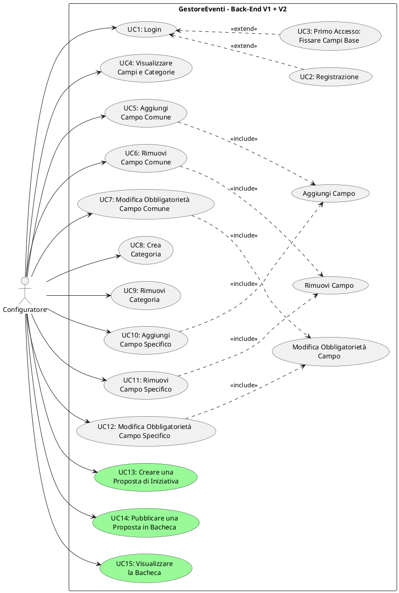

# Documentazione dei Casi d'Uso – Versione 2 (Delta rispetto a V1)

---

## 1. Riepilogo Relazione V1 → V2

I casi d'uso **UC1 – UC12** della Versione 1 (inclusi i casi d'uso inclusi *Aggiungi Campo*, *Rimuovi Campo*, *Modifica Obbligatorietà Campo*):
- ✔ **Invariati** — nessuna modifica funzionale
- ✔ **Non ridefiniti** — rimangono validi come documentati nella V1

La V2 introduce **3 nuovi casi d'uso**:
- **UC13** – Creare una Proposta di Iniziativa
- **UC14** – Pubblicare una Proposta in Bacheca
- **UC15** – Visualizzare la Bacheca

### Attori

| Attore | Stato V2 |
|---|---|
| **Configuratore** | Confermato. Unico attore anche in V2. Ora può anche creare proposte e visualizzare la bacheca. |

> [!NOTE]
> La specifica conferma: "Anche la seconda versione dell'applicazione consente l'accesso del solo configuratore." Il Fruitore sarà introdotto dalla V3.

---

## 2. Nuovi Casi d'Uso (SOLO V2)

---

### UC13 – Creare una Proposta di Iniziativa

| | |
|---|---|
| **Nome** | Creare una Proposta di Iniziativa |
| **Attore** | Configuratore |
| **Relazione V1** | Indipendente (nuovo caso d'uso V2) |
| **Scenario principale** | 1. Il configuratore seleziona "Creare una proposta di iniziativa" dal Menu Principale.   2. Il sistema mostra le categorie disponibili. Il configuratore ne seleziona una.   3. Il sistema presenta un modulo con tutti i campi della categoria (base, comuni, specifici), indicando tipo di dato e obbligatorietà di ciascuno.   4. Il configuratore compila i campi.   5. Il sistema valida automaticamente la proposta: verifica che tutti i campi obbligatori siano compilati e che i vincoli temporali siano rispettati.   6. La proposta acquisisce lo stato di **VALIDA**. Il sistema mostra un riepilogo della proposta.   Postcondizione: la proposta è in stato VALIDA. Se non pubblicata, verrà scartata al termine della sessione.   Fine |
| **Scenario alternativo** | 2a. Non esistono categorie.   Il sistema segnala l'assenza di categorie e torna al Menu Principale.   Fine |
| **Scenario alternativo** | 4a. Il configuratore digita "annulla" durante la compilazione.   Il sistema scarta la proposta.   Fine |
| **Scenario alternativo** | 5a. La proposta NON è valida (campi obbligatori mancanti o vincoli temporali violati).   Il sistema mostra l'elenco degli errori e chiede se il configuratore vuole correggere i campi errati.   5a.1. Il configuratore accetta di correggere: il sistema ripresenta solo i campi con errori.   Torna al punto 5. |
| **Scenario alternativo** | 5b. Il configuratore rifiuta di correggere.   La proposta viene scartata.   Fine |

**Vincoli temporali verificati dal sistema (dal codice):**
- "Termine ultimo di iscrizione" deve essere successivo alla data corrente
- "Data" dell'evento deve essere successiva di almeno 2 giorni rispetto a "Termine ultimo di iscrizione"
- "Data conclusiva" non può essere precedente a "Data"

---

### UC14 – Pubblicare una Proposta in Bacheca

| | |
|---|---|
| **Nome** | Pubblicare una Proposta in Bacheca |
| **Attore** | Configuratore |
| **Relazione V1** | Indipendente (nuovo caso d'uso V2) |
| **Scenario principale** | 1. Il configuratore richiede la pubblicazione di una proposta valida in bacheca.   2. Il sistema mostra il riepilogo della proposta e chiede conferma.   3. Il configuratore conferma la pubblicazione.   4. Il sistema verifica che il termine di iscrizione non sia già scaduto.   5. Il sistema verifica che non esista già una proposta con lo stesso Titolo, Data, Ora e Luogo.   6. La proposta passa dallo stato VALIDA allo stato **APERTA**, riceve la data di pubblicazione odierna e viene salvata persistentemente nella bacheca.   Postcondizione: la proposta è in stato APERTA e conservata in modo persistente nell'archivio delle proposte.   Fine |
| **Scenario alternativo** | 3a. Il configuratore non conferma la pubblicazione.   Il sistema segnala che la proposta non sarà salvata e verrà scartata al termine della sessione.   Fine |
| **Scenario alternativo** | 4a. Il termine di iscrizione è già scaduto.   Il sistema segnala l'errore. La proposta non viene pubblicata.   Fine |
| **Scenario alternativo** | 5a. Esiste già una proposta duplicata (stesso Titolo, Data, Ora, Luogo).   Il sistema segnala l'errore. La proposta non viene pubblicata.   Fine |

---

### UC15 – Visualizzare la Bacheca

| | |
|---|---|
| **Nome** | Visualizzare la Bacheca |
| **Attore** | Configuratore |
| **Relazione V1** | Indipendente (nuovo caso d'uso V2) |
| **Scenario principale** | 1. Il configuratore seleziona "Visualizzare la bacheca" dal Menu Principale.   2. Il sistema mostra tutte le proposte in stato APERTA, raggruppate per categoria. Per ogni proposta vengono mostrati i valori dei campi compilati.   3. Il configuratore prende visione e torna al Menu Principale.   Postcondizione: nessuna modifica al sistema.   Fine |
| **Scenario alternativo** | 2a. La bacheca è vuota (nessuna proposta aperta).   Il sistema mostra un messaggio indicante l'assenza di proposte.   Fine |

> [!NOTE]
> La specifica precisa: "nella versione attuale dell'applicazione, il contenuto della bacheca è visibile ai soli configuratori." A partire dalla V3, sarà visibile anche ai fruitori.

---

## 3. Analisi Critica V2

### 3.1. Coerenza V1 → V2

| Aspetto | Valutazione |
|---|---|
| Backward compatibility | ✅ Tutti i casi d'uso V1 (UC1–UC12) sono preservati senza alcuna modifica funzionale nel codice V2. |
| Menu Principale | ✅ Il menu V2 aggiunge 3 nuove voci (opzioni 4, 5, 6) senza alterare le prime 3 (gestione campi base, comuni, categorie). |
| Visualizzazione (UC4) | ✅ In V2, "Visualizzare campi e categorie" ha ora una voce di menu dedicata (`menuVisualizza`) che mostra in un'unica schermata campi base, comuni e categorie. Miglioramento rispetto alla V1 senza alterare la semantica del caso d'uso. |
| Persistenza | ✅ Nuovo file persistente (`v2_proposte.json`) per la bacheca, indipendente dall'archivio catalogo (`v2_catalogo.json`) e utenti (`v2_utenti.json`). |

### 3.2. Funzionalità implementate ma NON esplicitamente richieste dalla specifica V2

| Funzionalità | Descrizione |
|---|---|
| Rilevamento duplicati alla pubblicazione | Il sistema impedisce la pubblicazione di una proposta se ne esiste già una con lo stesso Titolo, Data, Ora e Luogo. La specifica non lo richiede, ma è un vincolo di integrità ragionevole. |
| Vincolo Data conclusiva ≥ Data evento | Il sistema verifica che la data conclusiva non sia precedente alla data dell'evento. La specifica menziona solo il vincolo tra Termine iscrizione e Data. |
| Validazione inline con correzione selettiva | Quando la proposta non è valida, il sistema ripresenta SOLO i campi con errori (non l'intero modulo). Miglioramento UX non richiesto dalla specifica. |

### 3.3. Incoerenze e problemi

| Aspetto | Dettaglio |
|---|---|
| Proposta non pubblicata → scartata | La specifica prevede che "una proposta valida creata ma non pubblicata non viene salvata". Il sistema la scarta correttamente al termine della sessione, ma non offre alcuna possibilità di salvarla come bozza per sessioni future. Questo è coerente con la specifica, ma rappresenta una limitazione funzionale. |
| Bacheca visibile solo ai configuratori | Limitazione corretta per V2 (la specifica lo conferma esplicitamente). Sarà risolta in V3 con l'introduzione del Fruitore. |
| Scadenza termine iscrizione alla pubblicazione | Se un configuratore crea una proposta valida ma non la pubblica immediatamente, e nel frattempo il termine scade (es: a cavallo della mezzanotte), la pubblicazione viene correttamente rifiutata con un messaggio di errore.  |

---

## 4. Diagramma UML Completo V1 + V2 (PlantUML)

### Legenda del diagramma

| Elemento | Significato |
|---|---|
| Sfondo bianco | Casi d'uso V1 (UC1–UC12 + inclusi) |
| Sfondo **verde** | Casi d'uso **nuovi della V2** (UC13–UC15) |
